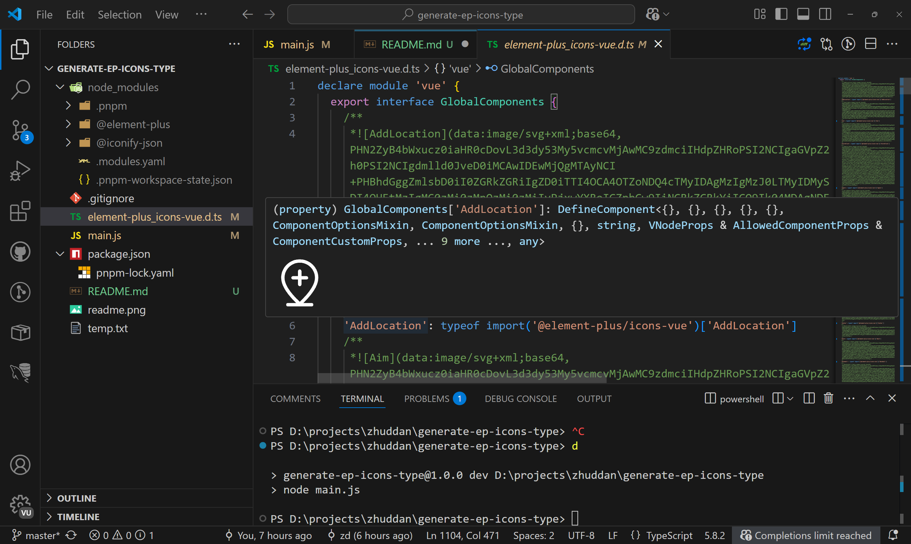
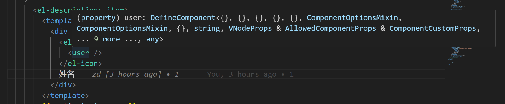
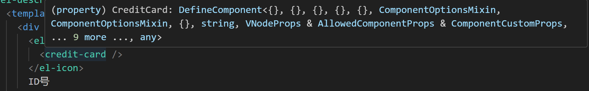

generate-ep-icons-type

生成 `@element-plus/icons-vue` 的全局组件提示，附加预览图



# 原理
1. 遍历 `@element-plus/icons-vue` 的组件
2. 匹配`@iconify-json/ep`中对应的的svg代码, 组合成`svg代码` 进而转换为 `base64`
3. 把 `base64` 作为 markdown 图片 插入到 `jsdoc` 中(jsdoc代码块允许markdown)


# 为什么 有 pascal / kebab 混合命名

考虑下面情况：

``` html
  <el-icon>  
    <user />
  </el-icon>
  <el-icon>  
    <credit-card />
  </el-icon>
```

当`element-plus_icons-vue.d.ts`的组件全部是大驼峰(pascal)命名时，`user` 组件不能会被`valor`正确识别成组件，但是没有图片预览, 但是 `credit-card` 可以正确被识别



然后改为减号(kebab)命名时候, `credit-card` 不能正确被识别,  但是 `user` 可以正确被识别




所以 `kebab` 命名下含有至少一个`-`的情况下，采用`pascal`,反之保持 `kebab`, 均可正常工作
